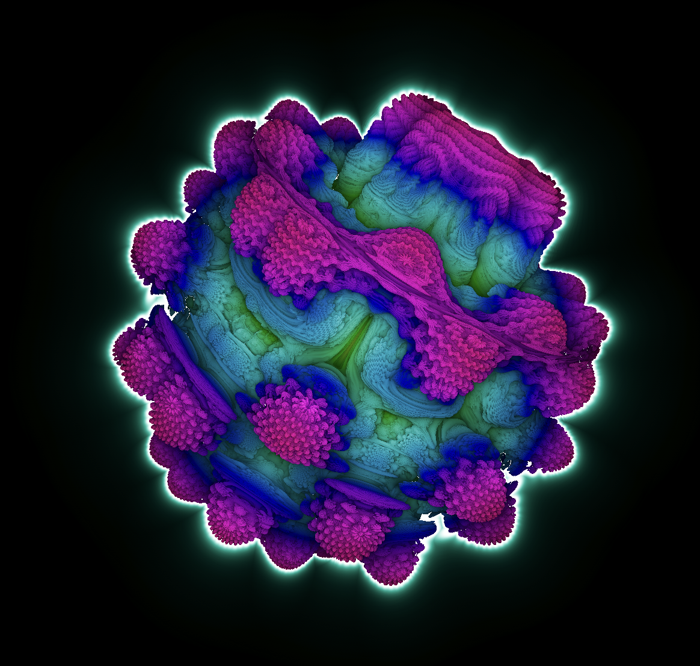
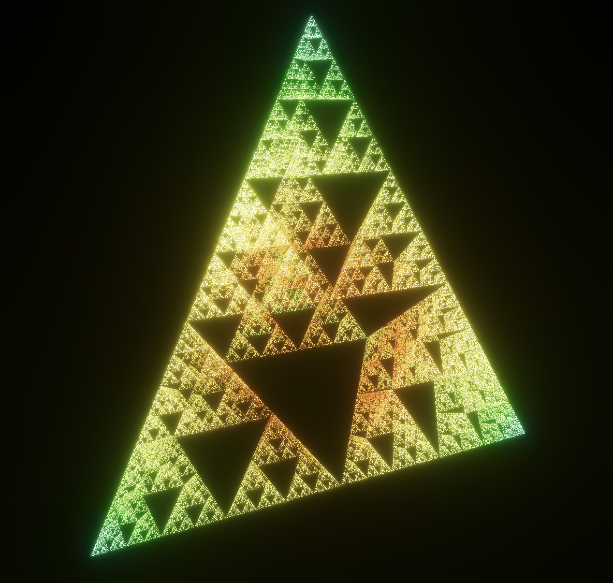
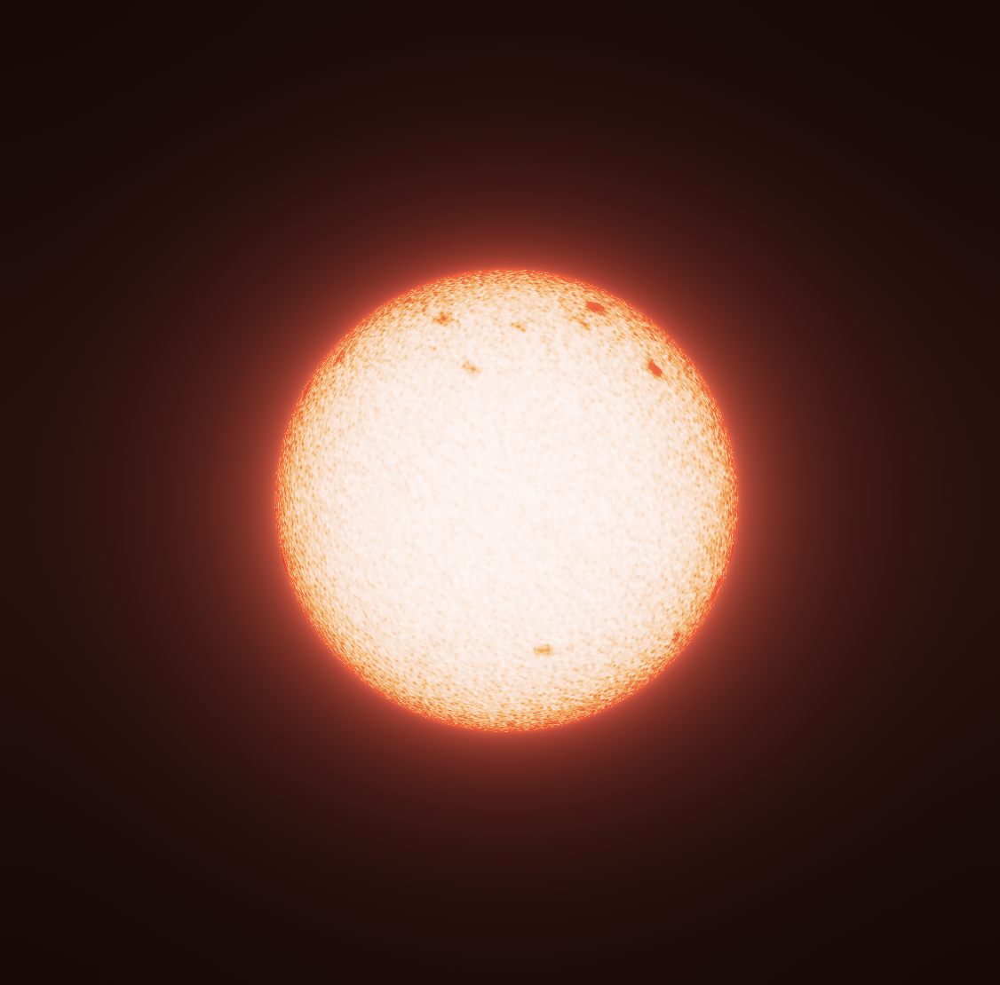
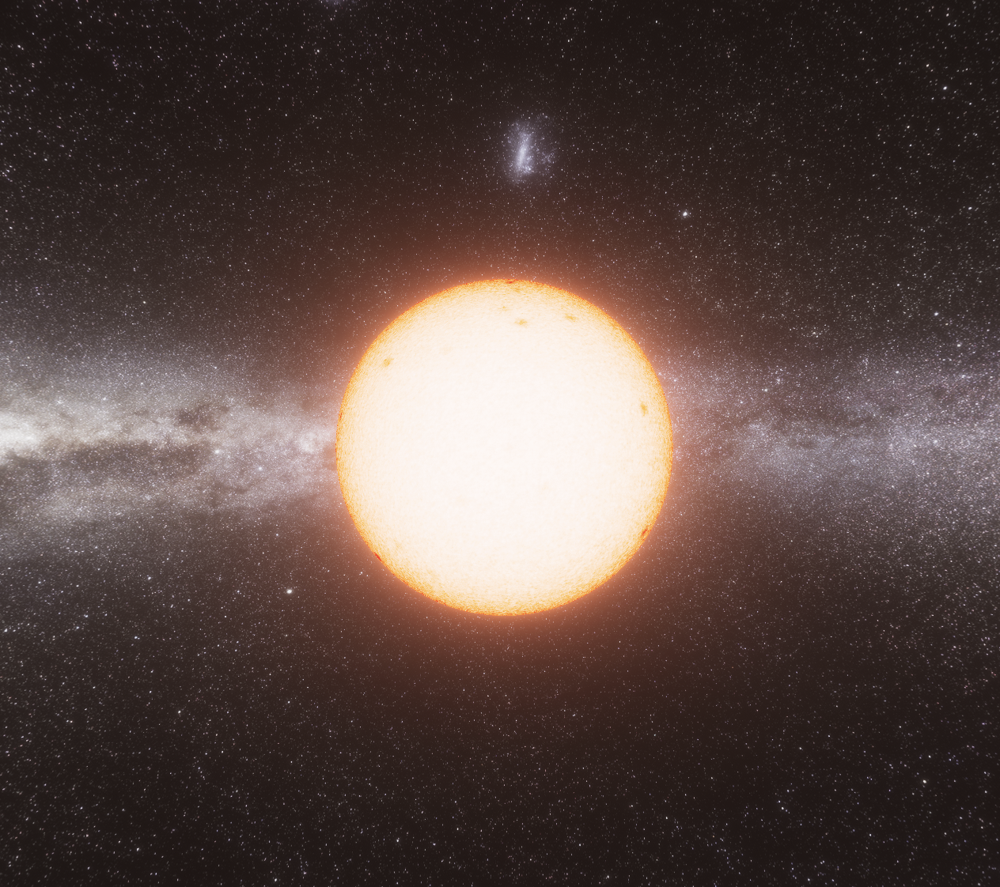

# Stellar
A hobby real-time rendering application, with the eventual goal of drawing black holes and realistic stars. 

This project uses the `wgpu` crate for rendering, `hecs` for application management, and `egui` to draw UI. It is mildly jank in some places, but hopefully will improve in quality as I implement more rendering pipelines/techniques. The goal is for it serve as a comprehensive framework for my various rendering escapades, and to support a number of cool visual effects. 

## Current Features
-  3d fractal raymarching
    - Mandelbulb 
    - Sierpinski's Tetrahedron 
- Basic star rendering 
- Skybox rendering 
- Post-processing pipeline
    - Bloom
    - ACES Tone-mapping

